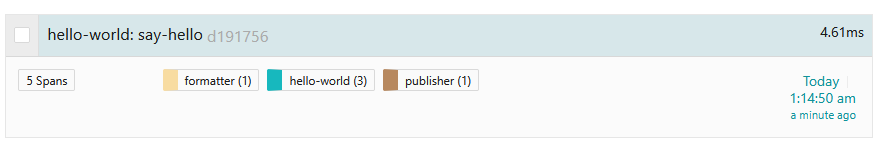

# Lesson 3 - Tracing RPC Requests

## Objectives

Learn how to:

* Trace a transaction across more than one microservice
* Pass the context between processes using `Inject` and `Extract`
* Apply OpenTracing-recommended tags

## Walkthrough

### Hello-World Microservice App

To save you some typing, we are going to start this lesson with a partial solution available in the [exercise](./exercise) package. We are still working with the same Hello World application, except that the `formatString` and `printHello` functions are now rewritten as RPC calls to two downstream services, `formatter` and `publisher`.

The package is organized as follows:

  * `client/hello.go` is the original `hello.go` from Lesson 2 modified to make HTTP calls
  * `formatter/formatter.go` is an HTTP server that responds to a request like
    `GET 'http://localhost:8081/format?helloTo=Bryan'` and returns `"Hello, Bryan!"` string
  * `publisher/publisher.go` is another HTTP server that responds to requests like
     `GET 'http://localhost:8082/publish?helloStr=hi%20there'` and prints `"hi there"` string to stdout.

To test it out, run the formatter and publisher services in separate terminals

```bash
$ go run ./lesson03/exercise/formatter/formatter.go
$ go run ./lesson03/exercise/publisher/publisher.go
```

Execute an HTTP request against the formatter:

```bash
$ curl 'http://localhost:8081/format?helloTo=Bryan'
Hello, Bryan!
```

Execute and HTTP request against the publisher:

```bash
$ curl 'http://localhost:8082/publish?helloStr=hi%20there'
```

Note that there will be no output from `curl`, but the publisher stdout will show `"hi there"`.

Finally, if we run the client app as we did in the previous lessons:

```bash
$ go run ./lesson03/exercise/client/hello.go Brian
2025/03/13 19:38:34 {"TraceID":"4a93e813b625a64b3762be91060b19bf","SpanID":"a22225246e18aa3b","TraceFlags":"01","TraceState":"","Remote":false}
2025/03/13 19:38:34 {"TraceID":"4a93e813b625a64b3762be91060b19bf","SpanID":"ceb20f50d2909f0f","TraceFlags":"01","TraceState":"","Remote":false}
2025/03/13 19:38:34 {"TraceID":"4a93e813b625a64b3762be91060b19bf","SpanID":"842488f37e7a1eac","TraceFlags":"01","TraceState":"","Remote":false}
```

We will see the publisher printing the line `"Hello, Brian!"`.

### Inter-Process Context Propagation

Since the only change we made in the `hello.go` app was to replace two operations with HTTP calls, the tracing story remains the same - we get a trace with three spans, all from `hello-world` service. But now we have two more microservices participating in the transaction and we want to see them in the trace as well. In order to continue the trace over the process boundaries and RPC calls, we need a way to propagate the span context over the wire. The OpenTelemetry API provides two functions in the `propagation` package to do that: `inject(ctx, carrier)` and `extract(ctx, carrier)`.

The `carrier` parameter refers to the data structure used to carry the context across process boundaries. OpenTelemetry supports several formats for propagation, including:

  * `TextMapPropagator` where the span context is encoded as a collection of string key-value pairs.
  * `TraceContextPropagator` which is based on the W3C Trace Context standard and encodes context using standardized HTTP headers.
  * `Baggage` propagator which handles user-defined key-value pairs for contextual data propagation. We will learn about this propagator in the next lesson [Baggage](../lesson04).

The `carrier` is an abstraction over the underlying transport framework. For example, a carrier for `TextMapPropagator` format is an interface that allows the tracer to read and write key-value pairs via `Get(key)` and `Set(key, value)` functions.

The tracing instrumentation uses `Inject` and `Extract` to pass the span context through the RPC calls.

### Instrumenting the Client

In the `formatString` function we already create a child span. In order to pass its context over the HTTP request we need to do the following:

#### Add an import

```go
import (
    "go.opentelemetry.io/otel/propagation"
)
```

#### Retrieve the `Propagator` and call the `Inject` method 

```go

// creating a span with custom attributes indicating that it is an RPC
ctx, span := tracer.Start(ctx, "formatString",
	trace.WithAttributes(
		semconv.NetPeerNameKey.String(url),
		semconv.HTTPMethodKey.String("GET"),
	),
	trace.WithSpanKind(trace.SpanKindClient),
)
defer span.End()

// retrieve the propagator
propagator := otel.GetTextMapPropagator()

// injecting the span context into the request headers
propagator.Inject(ctx, propagation.HeaderCarrier(req.Header))
```

In this case, the `carrier` is the HTTP request headers object, which we adapt to the carrier API by using `propagation.HeaderCarrier()`. Notice that we also add a couple of additional attributes to the span with some metadata about the HTTP request. The span is marked with a `span.kind` attribute set to `client`, as recommended by the OpenTelemetry. There are other attributes we could add.

We need to add similar code to the `printHello` function.

However, if we run this program, no context will be propagated because the function `otel.GetTextMapPropagator()` returns a no-op propagator by default. We need to replace the default `propagator` with our custom `propagator`. We need to update the `InitTracerProvider` function from our helper library as follows:

#### Add an import

```go
import (
    "go.opentelemetry.io/otel/propagation"
)
```

#### Replace the global default `propagator` with an instance of `TraceContextPropagator`

```go
// setting up a propagator to handle trace context propagation across the services
otel.SetTextMapPropagator(propagation.TraceContext{})
```


#### Handling Errors

Since we turned our single-binary program into a distributed application that makes remote calls, we need to handle errors that may occur during communications. It is a good practice to tag the span with the tag `error=true` if the operation represented by the span failed. So, let's go ahead and update the `formatString` and `printHello` function with below code snippet:

#### update `formatString` function to report the error
```go
resp, err := xhttp.Do(req)
	if err != nil {
		// recording the error in the span
		span.RecordError(err, trace.WithAttributes(
			attribute.String("format-response-error", fmt.Sprintf("Failed to format the string %s", helloTo))))
		return "", err
	}
```

#### update `printHello` function to report the error
```go
if _, err := xhttp.Do(req); err != nil {
		// recording the error in the span
		span.RecordError(err, trace.WithAttributes(
			attribute.String("publish-response-error", fmt.Sprintf("Failed to publish the string %s", helloStr))))
		return err
	}
```

If either of the Publisher or Formatter are down, our client app will report the error to the Backend(_Signoz_, _Jaeger_, _Tempo_). Backend will highlight all such errors in the UI corresponding to the failed span.

### Instrumenting the Servers

Our servers are currently not instrumented for tracing. Let's first update the Formatter service in `formatter/formatter.go`:

#### Add some imports

```go
import (
  "context"
  "github.com/yurishkuro/opentracing-tutorial/lib/tracing"
	"go.opentelemetry.io/otel"
	"go.opentelemetry.io/otel/attribute"
	"go.opentelemetry.io/otel/propagation"
	"go.opentelemetry.io/otel/trace"
)
```

#### Create an instance of a Tracer, similar to how we did it in `hello.go` in the `main` function

```go
// initialize the OpenTelemetry TracerProvider with the service name "formatter"
tracerPovider, err := tracing.InitTracerProvider("formatter")
if err != nil {
	log.Fatalf("failed to create otel exporter: %v", err)
}

// creating a context and defering the shutdown of the TracerProvider to ensure proper cleanup
ctx := context.Background()
defer func() {
	if err := tracerPovider.Shutdown(ctx); err != nil {
		log.Fatalf("failed to shutdown TracerProvider: %v", err)
	}
}()

// retrieving or creating a tracer with name "formatter-tracer"
tracer := tracerPovider.Tracer("formatter-tracer")

// handler function 
```

#### Extract the span context from the incoming request using the global `propagator` that was set when we called `InitTracerProvider` function in our helper library, for each request in the handler function

```go
// retrieve the global propagator
propagator := otel.GetTextMapPropagator()

// extracting the span context from the request headers
ctx := propagator.Extract(context.Background(), propagation.HeaderCarrier(r.Header))
```

#### Start a new child span representing the work of the server
Request headers contains the parent `TraceID`. `propagator.Extract` extracts this trace context and creates a new context with the TraceID `included`. We use `trace.SpanKindServer` option to indicate the operation of handling requests from clients on the server side.

```go
// starting a new span named "format" as a child of the extracted span context
_, span := tracer.Start(ctx, "format", trace.WithSpanKind(trace.SpanKindServer))
defer span.End()
```

#### Optionally, add tags / logs to that span

```go
// adding an event to the span indicating that the string was properly formatted
span.AddEvent("event", trace.WithAttributes(
	attribute.String("string-format", helloStr),
))
```
We need to update the `Publisher` service similarly.

### Take It For a Spin

As before, first run the `formatter` and `publisher` apps in separate terminals. Then run the `client/hello.go`. You should see the outputs like this:

```bash
# client
$ go run ./lesson03/exercise/client/hello.go Brian
2025/03/13 19:44:50 {"TraceID":"d19175660583032b22b169ea48aebccc","SpanID":"80d81967cd07e68d","TraceFlags":"01","TraceState":"","Remote":false}
2025/03/13 19:44:50 {"TraceID":"d19175660583032b22b169ea48aebccc","SpanID":"aaae4c27c31db753","TraceFlags":"01","TraceState":"","Remote":false}
2025/03/13 19:44:50 {"TraceID":"d19175660583032b22b169ea48aebccc","SpanID":"2541424024192fcc","TraceFlags":"01","TraceState":"","Remote":false}

# formatter
$ go run ./lesson03/exercise/formatter/formatter.go
2025/03/13 19:44:50 {"TraceID":"d19175660583032b22b169ea48aebccc","SpanID":"cbec81a83dc9c309","TraceFlags":"01","TraceState":"","Remote":false}

# publisher
$ go run ./lesson03/exercise/publisher/publisher.go
Hello, Brian!
2025/03/13 19:44:50 {"TraceID":"d19175660583032b22b169ea48aebccc","SpanID":"e62fade3a5a8512a","TraceFlags":"01","TraceState":"","Remote":false}
```

Note how all recorded spans show the same `TraceID`. This is a sign of correct instrumentation. It is also a very useful debugging approach when something is wrong with tracing. A typical error is to miss the context propagation somwehere, either in-process or inter-process, which results in different trace IDs and broken traces.

If we open this trace in the UI, we should see all five spans.




## Conclusion

The complete program can be found in the [solution](./solution) package.

Next lesson: [Baggage](../lesson04).