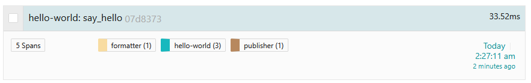

# Lesson 3 - Tracing RPC Requests

## Objectives

Learn how to:

* Trace a transaction across more than one microservice
* Pass the context between processes using `Inject` and `Extract`
* Apply OpenTracing-recommended tags

## Walkthrough

### Hello-World Microservice App

To save you some typing, we are going to start this lesson with a partial solution available in the [exercise](./exercise) package. We are still working with the same Hello World application, except that the `format_string` and `print_hello` functions are now rewritten as RPC calls to two downstream services, `formatter` and `publisher`.
The package is organized as follows:

  * `hello.py` is a copy from Lesson 2 modified to make HTTP calls
  * `formatter.py` is a Flask-based HTTP server that responds to a request like
    `GET 'http://localhost:8081/format?helloTo=Bryan'` and returns `"Hello, Bryan!"` string
  * `publisher.py` is another HTTP server that responds to requests like
     `GET 'http://localhost:8082/publish?helloStr=hi%20there'` and prints `"hi there"` string to stdout.

To test it out, run the formatter and publisher services in separate terminals

```
# terminal 2
$ python -m lesson03.exercise.formatter
 * Running on http://127.0.0.1:8081/ (Press CTRL+C to quit)

# terminal 3
$ python -m lesson03.exercise.publisher
 * Running on http://127.0.0.1:8082/ (Press CTRL+C to quit)
```

Execute an HTTP request against the formatter:

```
$ curl 'http://localhost:8081/format?helloTo=Bryan'
Hello, Bryan!%
```

Execute and HTTP request against the publisher:

```
$ curl 'http://localhost:8082/publish?helloStr=hi%20there'
published
```

The publisher stdout will show `"hi there"`.

Finally, if we run the client app as we did in the previous lessons:

```
$ python -m lesson03.exercise.hello Bryan
SpanContext(trace_id=0x8993d6ee03c04f6c2ffa4a306c617745, span_id=0xfa46b40e24df5ddd, trace_flags=0x01, trace_state=[], is_remote=False)
SpanContext(trace_id=0x8993d6ee03c04f6c2ffa4a306c617745, span_id=0x1312413b94ceb08a, trace_flags=0x01, trace_state=[], is_remote=False)
SpanContext(trace_id=0x8993d6ee03c04f6c2ffa4a306c617745, span_id=0x3a272d14414b1069, trace_flags=0x01, trace_state=[], is_remote=False)
```

We will see the `publisher` printing the line `"Hello, Bryan!"`.

### Inter-Process Context Propagation

Since the only change we made in the `hello.py` app was to replace two operations with HTTP calls, the tracing story remains the same - we get a trace with three spans, all from `hello-world` service. But now we have two more microservices participating in the transaction and we want to see them in the trace as well. In order to continue the trace over the process boundaries and RPC calls, we need a way to propagate the span context over the wire. The OpenTelemetry API provides two functions in the `Tracer` interface to do that: `inject(carrier)` and `extract(carrier)`.

The `carrier` parameter refers to the data structure used to carry the context across process boundaries. OpenTelemetry supports several formats for propagation, including:
* `TextMapPropagator`, where the span context is encoded as a collection of string key-value pairs
* `TraceContextTextMapPropagator`, based on the W3C Trace Context standard, which handles the propagation of both traces and baggage(We will learn about this propagator in the next lesson [Baggage](../lesson04)) by encoding context using standardized HTTP headers.

When using the `inject` method, you provide a Python dictionary as the `carrier`. However, `TraceContextTextMapPropagator` directly interacts with HTTP headers (e.g., `request.headers`). If using a Python dictionary for the `extract` method, ensure it includes a `get` function to correctly extract the items from the dictionary.

Tracing instrumentation uses `inject` and `extract` to pass the span context through the RPC calls.

### Instrumenting the Client

In the `format_string` function we already create a child span. Since we call `tracer.start_active_span()`, this child span will be available inside the helper function `http_get`.

```python
def format_string(hello_to):
    # obtain a tracer instance
    tracer: Tracer = get_tracer("say_hello_tracer")
    # starting a new span for the 'format_string' operation
    with tracer.start_as_current_span('format_string') as span:
        hello_str = http_get(8081, 'format', 'helloTo', hello_to)
        # adding a log to the span indicating that 'string-format-event' event has occured
        span.add_event('string-format-event', {'string-formatted': hello_str})
        print(span.get_span_context())
        return hello_str  
```
We need to add similar code to the `printHello` function. Now let's change `http_get` function to actually inject the span into HTTP headers using `headers` dictionary:

```python
def http_get(port, path, param, value):
    url = 'http://localhost:%s/%s' % (port, path)
    # retrieving the current active span
    span = trace.get_current_span()
    # setting HTTP method and URL attributes on the span
    span.set_attribute(SpanAttributes.HTTP_METHOD, 'GET')
    span.set_attribute(SpanAttributes.HTTP_URL, url)
    # Iniecting the span context into the HTTP headers for trace propagation
    headers = {}
    propagate.inject(headers)
    print(f"headers: {headers}")
    # sending the HTTP GET request with the propagated headers
    resp = requests.get(url, params={param: value}, headers=headers)
    resp.raise_for_status()
    return resp.text
```

Notice that we also add a couple additional tags to the span with some metadata about the HTTP request. There are other tags we could add.

We are missing a couple imports:

```python
from opentelemetry import propagate
from opentelemetry.semconv.trace import SpanAttributes
```

However, if we run this program, no context will be propagated because when we call `propagate.inject`, This function internally uses the global propagator to inject the current span context into the provided headers dictionary. The global propagator is no-op by default. We need to replace the default propagator with our custom one. To achieve this, we should update the `init_tracer_provider` function from our helper library as follows:

#### Add an import

```python
from opentelemetry import propagate
from opentelemetry.trace.propagation.tracecontext import TraceContextTextMapPropagator
```

#### Replace the global default `propagator` with an instance of `TraceContextPropagator`

Add the following line at the end of the function

```python
# setting up a propagator to propagate traces and baggage accross microservices
propagate.set_global_textmap(TraceContextTextMapPropagator())
```

### Instrumenting the Servers

Our servers are currently not instrumented for tracing. We need to do the following:

#### Add some imports

```python
from opentelemetry import propagate, trace
from opentelemetry.sdk.trace import TracerProvider, Tracer
from lib.tracing import init_tracer_provider, UnsupportedBackendError
```

#### Create an instance of a Tracer, similar to how we did it in `hello.py`

```python
# retrieve the global tracer provider
tracer_provider: TracerProvider = trace.get_tracer_provider()
# obtain a tracer instance from the tracer provider
tracer: Tracer = tracer_provider.get_tracer(tracer_name)
```

#### Extract the span context from the incoming request using the global `propagator` that was set when we called `init_tracer_provider` function in our helper library

```python
  # extracting the span context from the request headers
  ctx = propagate.extract(carrier=request.headers)
```

#### Start a new child span representing the work of the server
Request headers contain the parent `Traceparent`. When using `propagate.extract` method, a new context is created containing the `trace_id`. This context can then be used to create a new span, establishing a proper parent-child relationship even across service boundaries..

```python
# starting a new span with the extracted context
with tracer.start_as_current_span('format', context=ctx) as span:
  hello_to = request.args.get('helloTo')
  hello_str = f'Hello, {hello_to}!'
  # adding an event to the span indicating that request for publishing has been completed
  span.add_event('string-format-event', {'string-formatted': hello_str})
  return hello_str
```

Make similar changes in `publisher.py`. Note that we are still using `start_as_current_span` for consistency. In this example it does not make much of a difference, but if the logic in the formatter and publisher was more involved, we could benefit from propagating the span through `contextvar`.

### Take It For a Spin

As before, first run the `formatter` and `publisher` apps in separate terminals.
Then run the `hello.py`. You should see the outputs like this:

```
# client
$ python -m lesson03.exercise.hello Bryan
SpanContext(trace_id=0xa34ebb660c015b11ee6b8ef058c653c9, span_id=0x71622dde498452bf, trace_flags=0x01, trace_state=[], is_remote=False)
SpanContext(trace_id=0xa34ebb660c015b11ee6b8ef058c653c9, span_id=0xec2ed31df84af745, trace_flags=0x01, trace_state=[], is_remote=False)
SpanContext(trace_id=0xa34ebb660c015b11ee6b8ef058c653c9, span_id=0xa9eca7f71c4503c9, trace_flags=0x01, trace_state=[], is_remote=False)

# formatter
$ python -m lesson03.exercise.formatter
SpanContext(trace_id=0xa34ebb660c015b11ee6b8ef058c653c9, span_id=0x9916e13b104e0d98, trace_flags=0x01, trace_state=[], is_remote=False)
127.0.0.1 - - [13/Jul/2024 14:04:06] "GET /format?helloTo=Brian HTTP/1.1" 200 -

# publisher
$ python -m lesson03.exercise.publisher
Hello, Brian!
SpanContext(trace_id=0xa34ebb660c015b11ee6b8ef058c653c9, span_id=0x829c711f0aba36f0, trace_flags=0x01, trace_state=[], is_remote=False)
127.0.0.1 - - [13/Jul/2024 14:04:06] "GET /publish?helloStr=Hello,+Brian! HTTP/1.1" 200 -
```

Note how all recorded spans show the same trace ID `0xa34ebb660c015b11ee6b8ef058c653c9`. This is a sign of correct instrumentation. It is also a very useful debugging approach when something is wrong with tracing. A typical error is to miss the context propagation somewhere, either in-process or inter-process, which results in different trace IDs and broken traces.

If we open this trace in the UI, we should see all five spans.



## Conclusion

The complete program can be found in the [solution](./solution) package.

Next lesson: [Baggage](../lesson04).
