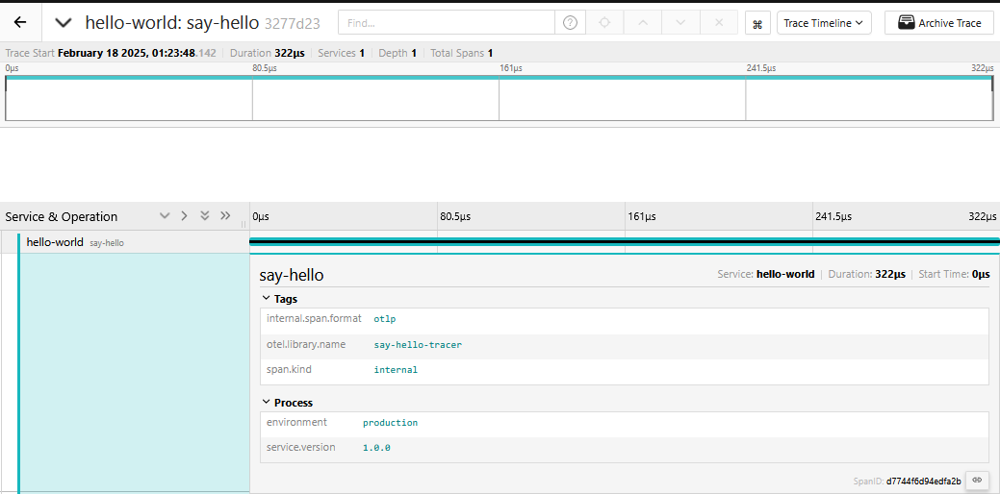
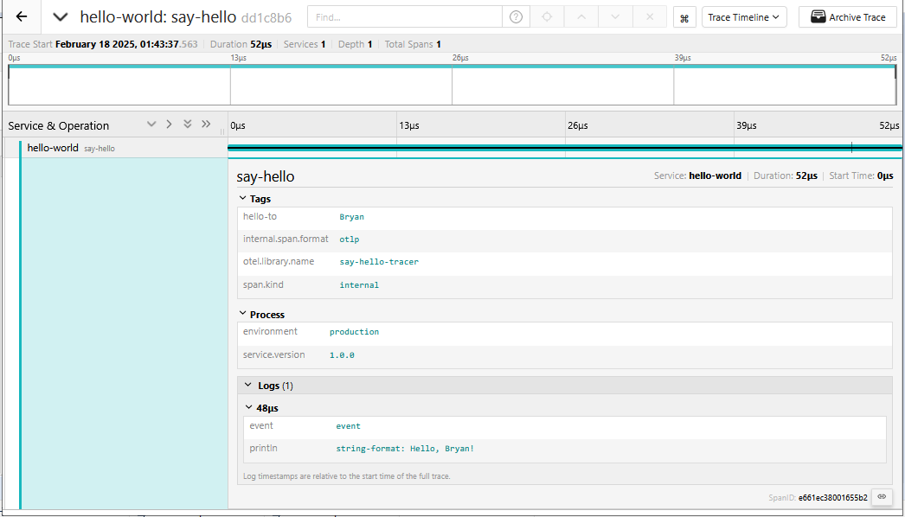

# Lesson 1 - Hello World

## Objectives

Learn how to:

* Instantiate a Tracer
* Create a simple trace
* Add attributes to a span

## Walkthrough

### A simple Hello-World program

Let's create a simple Rust program `cargo new lesson01` that takes an argument and prints "Hello, {arg}!".

```rust
use std::env;

fn main() {
    let args: Vec<_> = env::args().collect();
    if args.len() != 2 {
        panic!("ERROR: Expecting one argument");
    }

    let hello_to = args[1].clone();

    // doing some work
    let hello_str = format!("Hello, {}!", hello_to);
    println!("{}", hello_str);
}
```

Run it:

``` bash
$ cargo run Bryan
Hello, Bryan!
```

### Create a trace

A trace is a directed acyclic graph of spans. A span is a logical representation of some work done in your application. Each span has these minimum attributes: an operation name, a start time, and a finish time.

Let's create a trace that consists of just a single span. To do that we need an instance of the `opentelemetry_sdk::trace::SdkTracerProvider`. 

#### Initialize a custom TracerProvider

Let's create an instance of a tracer provider and set this as the global tracer provider, this allows applications to not manually pass references of the tracer provider to each part of the code that needs to create spans.

```rust
use opentelemetry::{
    global, trace::{Span, TraceError, Tracer}, KeyValue
};
use opentelemetry_sdk::{
    propagation::TraceContextPropagator, trace::SdkTracerProvider, Resource
};
use opentelemetry_otlp::WithExportConfig;
use std::env;


const TRACING_BACKEND: &str = "http://192.168.50.4:4318/v1/traces";

/// initializes the OpenTelemetry Tracer with the specified service name and default backend.
fn init_tracer(service: &str) -> Result<SdkTracerProvider, TraceError>{
    init_tracer_with_backend(service, TRACING_BACKEND)
}

/// initializes the OpenTelemetry Tracer with the specified service name and backend.
fn init_tracer_with_backend(service: &str, backend: &str) -> Result<SdkTracerProvider, TraceError>{

    // creating an OTLP trace exporter to send spans using HTTP to the specified backend
    let exporter = opentelemetry_otlp::SpanExporter::builder().with_http().with_endpoint(backend).build()?;

    // defining resource attributes for the service
    let resource = Resource::builder_empty()
        .with_attributes([
                // service name
                KeyValue::new("service.name", service.to_string()),
                // version number of the environment
                KeyValue::new("service.version", "1.0.0".to_string()),
                // environment
                KeyValue::new("environment", "production".to_string()),
            ])
        .build();

    // creating a TracerProvider with the specified exporter and resource attributes
    let tp = SdkTracerProvider::builder()
        .with_batch_exporter(exporter)
        .with_resource(resource)
        .build();

    // setting up the global tracer provider
    global::set_tracer_provider(tp.clone());
    

    // Set up a propagator to handle context propagation across services.
    global::set_text_map_propagator(TraceContextPropagator::new());

    Ok(tp)
}
```

We are using the following basic features of the OpenTelemetry API:
  * `global`, The global trace API provides applications access to their configured `TracerProvider` instance from anywhere in the codebase. This allows applications to not manually pass references to each part of the code that needs to create spans. 
  * a `TracerProvider` A tracer provider creates tracers which can then be used to create traces and spans.
  * a `Tracer` instance is used to start new spans via `start` method.
  * each `Span` instance is given an _operation name_, `"say-hello"` in this case.
  * each `Span` instance must be ended by calling it's `end` method.
  * the start and end timestamps of the span will be captured automatically by the tracer implementation.

#### Usage

To use this instance, let's change the `main` function:

```rust
    let args: Vec<_> = env::args().collect();
    if args.len() != 2 {
        panic!("ERROR: Expecting one argument");
    }

    let hello_to = args[1].clone();

    // initializing the OpenTelemetry Tracer with the service name "hello-world"
    let tp = init_tracer("hello-world")
        .expect("Error initializing tracer");

    // creating a named instance of Tracer via the configured GlobalTracerProvider
    let tracer = global::tracer("say-hello-tracer");

    // creating a new span named "say-hello".
    let mut span =  tracer.start("say-hello");

    // doing some work
    let hello_str = format!("Hello, {}!", hello_to);
    println!("{}", hello_str);

    // ending the span to ensure it gets sent to the backend
    span.end();
```

Note that we are passing a string `hello-world` to the `start` method. It is used to mark all spans emitted by the tracer as originating from a `hello-world` service.

If we run the program now, we should see a span logged:

```bash 
$ cargo run  Bryan
Hello, Bryan!
```

If you have a backend(Signoz, Tempo and Grafana or Jaeger) running, you should be able to see the trace in the UI.



### Adding Attributes and Events to a span

Right now the trace we created is very basic. If we call our program with `hello.go Susan` instead of `hello.go Bryan`, the resulting traces will be nearly identical. It would be nice if we could capture the program arguments in the traces to distinguish them.

One naive way is to use the string `"Hello, Bryan!"` as the _operation name_ of the span, instead of `"say-hello"`. However, such practice is highly discouraged in distributed tracing, because the operation name is meant to represent a _class of spans_, rather than a unique instance. For example, in Jaeger UI you can select the operation name from a dropdown when searching for traces. It would be very bad user experience if we ran the program to say hello to a 1000 people and the dropdown then contained 1000 entries. Another reason for choosing more general operation names is to allow the tracing systems to do aggregations. For example, Jaeger tracer has an option of emitting metrics for all the traffic going through the application. Having a unique operation name for each span would make the metrics useless.

The recommended solution is to add attributes and events(logs) to spans. An _attribute_ is a key-value pair that provides certain metadata about the span. An _event_ is similar to a regular log statement, it contains a timestamp and some data, but it is associated with span from which it was logged.

When should we use attributes vs. events?  The attributes are meant to describe attributes of the span that apply to the whole duration of the span. For example, if a span represents an HTTP request, then the URL of the request should be recorded as an attribute because it does not make sense to think of the URL as something that's only relevant at different points in time on the span. On the other hand, if the server responded with a redirect URL, logging it would make more sense since there is a clear timestamp associated with such an event.

#### Adding Attributes

In the case of `cargo run Bryan`, the string "Bryan" is a good candidate for a span attribute, since it applies
to the whole span and not to a particular moment in time. We can record it like this:

```rust
// adding an attribute to the span
span.set_attribute(KeyValue::new("hello-to", hello_to.to_string()));
```

#### Adding Events

Our hello program is so simple that it's difficult to find a relevant example of a log, but let's try.
Right now we're formatting the `helloStr` and then printing it. Both of these operations take certain
time, so we can log their completion:

```rust
use std::time::SystemTime;

// adding logs to the span
span.add_event_with_timestamp(
    "event",
    SystemTime::now(),
    vec![KeyValue::new("println", format!("string-format: {}", hello_str))]
);
```

The log statements might look a bit strange if you have not previously worked with a structured logging API. Rather than formatting a log message into a single string that is easy for humans to read, structured logging APIs encourage you to separate bits and pieces of that message into key-value pairs that can be automatically processed by log aggregation systems. The idea comes from the realization that today most logs are processed by machines rather than humans.

The OpenTelemetry API for Rust provides structured logging through the use of events and attributes:
  * The `add_event` method allows you to add an event to a span, which can include a name and a set of attributes. 
  * The `add_event_with_timestamp` method allows you to add an event with a time-stamp, thus providing a way to log significant occurrences within the span’s lifetime.
  * Attributes can be added to events using the `set_attributes` method, which takes a vector of key-value pairs in the form of `opentelemetry::KeyValue`.

The OpenTelemetry Specification also recommends that all events contain an `event` attribute that describes the overall event being logged, with other attributes of the event provided as additional fields.

If you run the program with these changes, then find the trace in the UI and expand its span (by clicking on it), you will be able to see the tags and logs.



## Conclusion

The complete program can be found in the [src](./src) dir.

Next lesson: [Context and Tracing Functions](../lesson02).