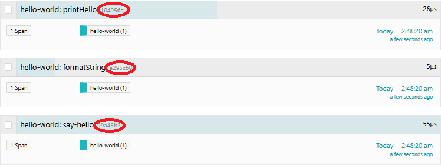
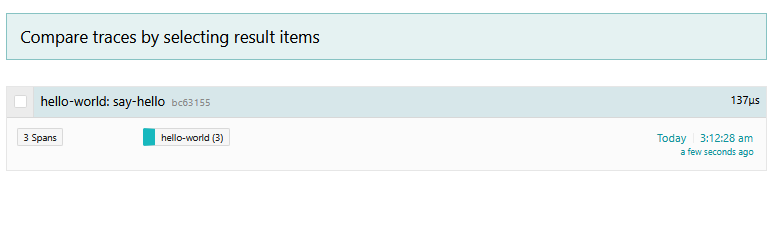
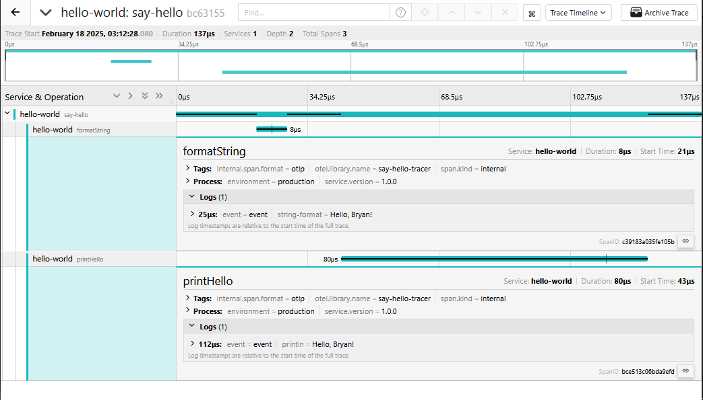

# Lesson 2 - Context and Tracing Functions

## Objectives

Learn how to:

* Trace individual functions
* Combine multiple spans into a single trace
* Propagate the in-process context

## Walkthrough

First, copy your work or the official solution from [Lesson 1](../lesson01) to `lesson02/exercise/src/main.rs`.

### Tracing individual functions

In [Lesson 1](../lesson01) we wrote a program that creates a trace that consists of a single span. That single span combined two operations performed by the program, formatting the output string and printing it. Let's move those operations into standalone functions first:

```rust
// initializing the OpenTelemetry Tracer with the service name "hello-world"
let tp = init_tracer("hello-world")
    .expect("Error initializing tracer");

// creating a named instance of Tracer via the configured GlobalTracerProvider
let tracer = global::tracer("say-hello-tracer");

// creating a new span named "say-hello".
let mut span =  tracer.start("say-hello");

// adding an attribute to the span
span.set_attribute(KeyValue::new("hello-to", hello_to.to_string()));

// calling `format_string` function.
let hello_str = format_string(&mut span, hello_to.as_str());

// calling `print_hello` function.
print_hello(&mut span, hello_str);
```

and the functions:

```rust
// Function to format the greeting string
fn format_string(span: &mut BoxedSpan, hello_to: &str)-> String {
	// doing the work
	let hello_str = format!("Hello, {}!", hello_to);

	// adding an event with timestamp to the span.
    span.add_event_with_timestamp(
        "event",
        SystemTime::now(),
        vec![KeyValue::new("string-format", hello_str.clone())],
    );

	return hello_str
}

// function to print the greeting string
fn print_hello(span: &mut BoxedSpan, hello_str: String) {
    // doing the work
	println!("{}", hello_str);

	// adding an event with timestamp to the span.
    span.add_event_with_timestamp(
        "event",
        SystemTime::now(),
        vec![KeyValue::new("println", hello_str)],
    );
}
```

Of course, this does not change the outcome(except now, we have two events being recorded one for `string-format` and other for `println`). What we really want to do is to wrap each function into its own span.

### Wrapping Each Function in Its Own Span

To track the execution of individual functions as separate spans, we need start a new span in each of the functions. Let's modigy the functions as follows:

```rust
// function to format the greeting string
fn format_string(hello_to: &str)-> String {
	// retrieve or create a named tracer.
	let tracer = global::tracer("say-hello-tracer");

	// start a new span named "formatString".
    let mut span =  tracer.start("formatString");

    // doing the work
	let hello_str = format!("Hello, {}!", hello_to);

	// adding an event to the span.
    span.add_event_with_timestamp(
        "event",
        SystemTime::now(),
        vec![KeyValue::new("string-format", hello_str.clone())],
    );

    span.end();

	return hello_str
}

// function to print the greeting string
fn print_hello(hello_str: String) {
	// Retrieve or create a named tracer
    let tracer = global::tracer("say-hello-tracer");

	// start a new span named "printHello"
    let mut span =  tracer.start("printHello");

    // doing the work
	println!("{}", hello_str);

	// adding an event to the span.
    span.add_event_with_timestamp(
        "event",
        SystemTime::now(),
        vec![KeyValue::new("println", hello_str)],
    );

    span.end();
}
```
and the main function:

```rust
...

// creating a named instance of Tracer via the configured GlobalTracerProvider
let tracer = global::tracer("say-hello-tracer");

// creating a new span named "say-hello".
let mut span =  tracer.start("say-hello");

// adding an attribute to the span
span.set_attribute(KeyValue::new("hello-to", hello_to.to_string()));

// calling `format_string` function.
let hello_str = format_string(hello_to.as_str());

// calling `print_hello` function.
print_hello(hello_str);

...
```


Let's run it:

```bash
$ cargo run Bryan
Hello, Bryan!
```

We got three spans, but there is a problem here. The TraceIDs are all different. If we search for those IDs in the UI each one will represent a standalone trace with a single span. That's not what we wanted!



### Establishing Parent-Child Relationship

What we really wanted was to establish causal relationship between the two new spans to the root span started in `main`. We can do that by using the `tracer.in_span` method in the main function. This method starts a new span and sets it as the active span for the given function. It then executes the closure. It ends the span when the closure completes. When you use `tracer.in_span` method, the OpenTelemetry SDK sets up the parent span as the current context for the duration of that closure. Any spans created inside that closure (or functions called from within it) will automatically inherit that active context as their parent. So the main function needs to be updated to:

```rust
...

// creating a named instance of Tracer via the configured GlobalTracerProvider
let tracer = global::tracer("say-hello-tracer");

// creating a new span named "say-hello".
tracer.in_span("say-hello", |cx|{
    let span = cx.span();
    // adding an attribute to the span
    span.set_attribute(KeyValue::new("hello-to", hello_to.to_string()));

    // calling `format_string` function.
    let hello_str = format_string(hello_to.as_str());

    // calling `print_hello` function.
	print_hello(hello_str);
});

...
```

On running the app, we'll see that all reported spans now belong to the same trace:

```
$ cargo run Bryan
Hello, Bryan!
```

If we find this trace in the UI, it will show a proper parent-child relationship between the spans.





## Conclusion

The complete program can be found in the [src](./src) dir.

Next lesson: [Tracing RPC Requests](../lesson03).