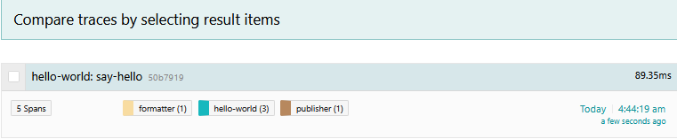
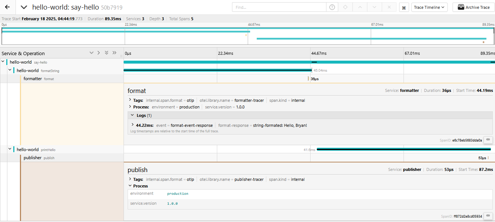

# Lesson 3 - Tracing RPC Requests

## Objectives

Learn how to:

* Trace a transaction across more than one microservice
* Pass the context between processes using `inject_context` and `extract`
* Apply OpenTelemetry-recommended tags

## Walkthrough

### Hello-World Microservice App

To save you some typing, we are going to start this lesson with a partial solution available in the [exercise](./exercise) dir. We are still working with the same Hello World application, except that the `format_string` and `print_hello` functions are now rewritten as RPC calls to two downstream services, `formatter` and `publisher`.

The package is organized as follows:

  * `./exercise/src/bin/client.rs` is the original `hello.go` from Lesson 2 modified to make HTTP calls
  * `./exercise/src/bin/formatter.rs` is an HTTP server that responds to a request like
    `GET 'http://localhost:8081/format?helloTo=Bryan'` and returns `"Hello, Bryan!"` string
  * `./exercise/src/bin/publisher.rs` is another HTTP server that responds to requests like
     `GET 'http://localhost:8082/publish?helloStr=hi%20there'` and prints `"hi there"` string to stdout.

To test it out, run the formatter and publisher services in separate terminals

```bash
$ cd exercise
$ cargo run --bin formatter 
$ cargo run --bin publisher
```

Execute an HTTP request against the formatter:

``` bash
$ curl 'http://localhost:8081/format?helloTo=Bryan'
Hello, Bryan!
```

Execute and HTTP request against the publisher:

```bash
$ curl 'http://localhost:8082/publish?helloStr=hi%20there'
```

Note that there will be no output from `curl`, but the publisher stdout will show `"hi there"`.

Finally, if we run the client app as we did in the previous lessons:

```bash
$ cargo run --bin client Bryan
```

We will see the publisher printing the line `"Hello, Bryan!"`.

### Inter-Process Context Propagation

Since the only change we made in the application was to replace two operations with HTTP calls, the tracing story remains the same - we get a trace with three spans, all from `hello-world` service. But now we have two more microservices participating in the transaction and we want to see them in the trace as well. In order to continue the trace over the process boundaries and RPC calls, we need a way to propagate the span context over the wire. 

OpenTelemetry provides the following propagators:

  * `TextMapPropagator` where the span context is encoded as a collection of string key-value pairs.
  * `TraceContextPropagator` which is based on the W3C Trace Context standard and encodes context using standardized HTTP headers.
  * `Baggage` propagator which handles user-defined key-value pairs for contextual data propagation. We will learn about this propagator in the next lesson [Baggage](../lesson04).

The tracing instrumentation uses `propagator.inject` and `propagator.extract` methods to pass the span context through the RPC calls. In case of HTTP, the spans are propagated via HTTP headers. The OpenTelemetry API provides an helper in the `opentelemetry_http` which has `HeaderInjector` and `HeaderExtractor`.

### Instrumenting the Client

In the `format_string` function we already create a child span. In order to pass its context over the HTTP request we need to do the following:

#### Add an import

```rust
use opentelemetry::{
    global, trace::{Span, TraceContextExt, Tracer, FutureExt}, KeyValue,
};

use opentelemetry_http::HeaderInjector;
```

#### Retrieve the `Propagator` and call the `inject` method 

```rust
...

// retrieve or create a named tracer
let tracer = global::tracer("say-hello-tracer");

// start a new span named "formatString".
let span =  tracer.start("formatString");
    
// getting spancontext with the current span included.
let cx = opentelemetry::Context::current_with_span(span);

// preparing to send an http get request to the "formatter" service
let client = Client::new();
let mut params = HashMap::new();
params.insert("hello_to".to_string(), hello_to.to_string());

// creating a get request to the formatter service
let mut req = client.get(FORMAT_URL).query(&params).build()?;

// fetching the headers from the request just created
let headers = req.headers_mut();

// injecting the span context into request headers
global::get_text_map_propagator(|propagator| {
    propagator.inject_context(&cx, &mut HeaderInjector(headers))
});

...

```

In this case, the `carrier` is the HTTP request headers object. We use `HeaderInjector` from the `opentelemetry_http` crate to inject the span context `cx` in to the headers object `headers`.

We need to add similar code to the `publish_string` function.

However, if we run this program, no context will be propagated because the function `global::get_text_map_propagator` returns a no-op propagator by default. We need to replace the default `propagator` with our custom `propagator`. We need to update the `init_tracer` function from our helper library `lib.rs` as follows:

#### Add an import

```rust
use opentelemetry_sdk::propagation::TraceContextPropagator;
```

#### Replace the global default `propagator` with an instance of `TraceContextPropagator`

```rust
// setting up a propagator to handle trace context propagation across the services
global::set_text_map_propagator(TraceContextPropagator::new());
```


#### Handling Errors

Since we turned our single-binary program into a distributed application that makes remote calls, we need to handle errors that may occur during communications. So, let's go ahead and update the `format_string` and `publish_string` function with below code snippet:

#### update `format_string` function to report the error
```rust

...

match client.execute(req).await{
    Err(err) =>{
        // recording the error in the span
        cx.span().record_error(&err);

        // ending the span
        cx.span().end();

        return Err(err);
    },
    Ok(resp) =>{
        let hello_str = resp.text().await?;

        // adding an event to the span indicating a successful response was received
        cx.span().add_event("format-event-response", 
        vec![
            KeyValue::new("format-response", format!("string-format: {}", hello_str)),
        ]);

        // ending the span
        cx.span().end();
            
        Ok(hello_str)
    }   
}

...

```

#### update `publish_string` function to report the error
```go

...

match client.execute(req).await{
    Err(err) =>{
        // recording the error in the span
        cx.span().record_error(&err);
            
        // ending the span
        cx.span().end();
            
        return Err(err);
    },
    Ok(_) =>{
        // ending the span
        cx.span().end();
        
        Ok(())
    }   
}

...

```

If either of the Publisher or Formatter are down, our client app will report the error to the Backend(_Signoz_, _Jaeger_, _Tempo_). Backend will highlight all such errors in the UI corresponding to the failed span.

### Instrumenting the Servers

Our servers are currently not instrumented for tracing. Let's first update the Formatter service in `bin/formatter.rs`:

#### Add some imports

```rust
use std::collections::HashMap;
use axum::{
    extract::Query,
    http::HeaderMap,
    routing::get,
    Router,
};
use tokio::net::TcpListener;

use opentelemetry::{
    global, trace::{Span, Tracer}, KeyValue,
};
use opentelemetry_http::HeaderExtractor;

use exercise::init_tracer;
```

#### Create an instance of a Tracer, similar to how we did it in `client.rs` in the `main` function

```rust
// initializing the OpenTelemetry TracerProvider with the service name "formatter"
let tp = init_tracer("formatter")
        .expect("Error initializing tracer");

// retrieving or creating a tracer with name "formatter-tracer"
let tracer = tp.Tracer("formatter-tracer")

// handler function
let app = Router::new().route("/format", get(format_handler));

// running the server
let listener = TcpListener::bind("0.0.0.0:8081").await.unwrap();
axum::serve(listener, app).await.unwrap();

// shutting down the tracer provider to ensure all spans are flushed.
tp.shutdown().expect("TracerProvider should shutdown successfully");

```

#### Extract the span context from the incoming request using the global `propagator` that was set when we called `init_tracer` function in our helper library `lib.rs`, for each request in the handler function

```rust
// creating a named instance of Tracer via the configured GlobalTracerProvider
let tracer = global::tracer("formatter-tracer");
    
// extracting the span context from the request headers
let cx = global::get_text_map_propagator(|propagator| {
    propagator.extract(&HeaderExtractor(&headers))
});
```

#### Start a new child span representing the work of the server
Request headers contains the parent `TraceID`. `propagator.extract` extracts this trace context and creates a new context with the TraceID `included`.

```rust
// starting a new span named "format" as a child of the extracted span context
let mut span = tracer.start_with_context("format", &cx);
```

#### Optionally, add tags / logs to that span

```rust
// adding an event to the span indicating that the string was properly formatted
span.add_event("format-event-response", 
vec![
    KeyValue::new("format-response", format!("string-formated: {}", resp)),
    ]
);

Span::end(&mut span);

```
We need to update the `publisher` service similarly.

### Take It For a Spin

As before, first run the `formatter` and `publisher` apps in separate terminals. Then run the `client/hello.go`. You should see the outputs like this:

```bash
# client
$ cargo run --bin client

# formatter
$ cargo run --bin formatter

# publisher
$ cargo run --bin publisher
```

Note how all recorded spans show the same `TraceID`. This is a sign of correct instrumentation. It is also a very useful debugging approach when something is wrong with tracing. A typical error is to miss the context propagation somwehere, either in-process or inter-process, which results in different trace IDs and broken traces.

If we open this trace in the UI, we should see all five spans.





## Conclusion

The complete program can be found in the [solution](./solution) package.

Next lesson: [Baggage](../lesson04).